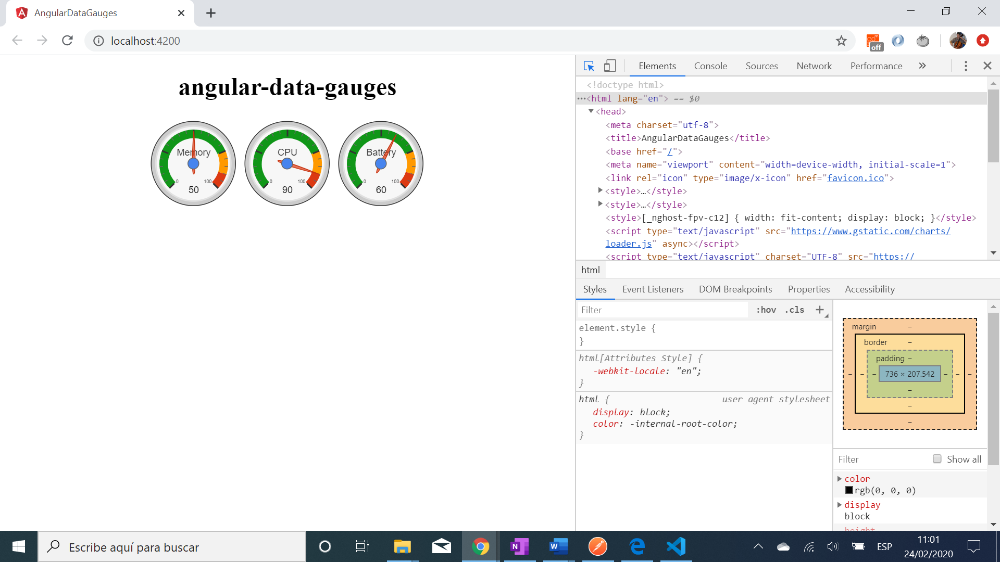

# :zap: Angular Data Gauges

* Angular app using the [Google Charts](https://developers.google.com/chart) API to visualise data using [gauges](https://google-developers.appspot.com/chart/interactive/docs/gallery/gauge)
* **Note:** to open web links in a new window use: _ctrl+click on link_


## :page_facing_up: Table of contents

* [:zap: Angular Data Gauges](#zap-angular-data-gauges)
  * [:page\_facing\_up: Table of contents](#page_facing_up-table-of-contents)
  * [:books: General info](#books-general-info)
  * [:camera: Screenshots](#camera-screenshots)
  * [:signal\_strength: Technologies](#signal_strength-technologies)
  * [:floppy\_disk: Setup](#floppy_disk-setup)
  * [:computer: Code Examples](#computer-code-examples)
  * [:cool: Features](#cool-features)
  * [:clipboard: Status \& To-Do List](#clipboard-status--to-do-list)
  * [:clap: Inspiration](#clap-inspiration)
  * [:file\_folder: License](#file_folder-license)
  * [:envelope: Contact](#envelope-contact)

## :books: General info

* basic working app that displays 3 gauges with green, orange and red colours configurable from the `app.component.ts` file.
* Google chart tools have a wide range of interactive charts and data tools.

## :camera: Screenshots



## :signal_strength: Technologies

* [Angular v16](https://angular.io/)
* [npm angular google charts v2](https://www.npmjs.com/package/angular-google-charts)

## :floppy_disk: Setup

* Install dependencies using `npm i`.
* Run `ng serve` for a dev server. Navigate to `http://localhost:4200/`. The app will automatically reload if you change any of the source files.
* Run `npm run build` to create a build folder named `docs`. Rename `index.html` to `404.html` if using Github pages `docs` option.

## :computer: Code Examples

* app.component.ts - creates the gauge data

```typescript
export class AppComponent {
  title = 'angular-data-gauges';

  @ViewChild('googlechart')
  googlechart: GoogleChartsModule;
  chart = {
    title: 'angular-data-gauges',
    type: 'Gauge',
    data: [
      ['Memory', 50],
      ['CPU', 90],
      ['Battery', 60]
    ],
    options: {
      width: 400,
      height: 120,
      greenFrom: 0,
      greenTo: 75,
      redFrom: 90,
      redTo: 100,
      yellowFrom: 75,
      yellowTo: 90,
      minorTicks: 5
    }
  };
}
```

## :cool: Features

* Dashboards can be used to manage multiple charts that share the same data.
* Data can also be fetched from a REST API endpoint or database service call.

## :clipboard: Status & To-Do List

* Status: Working
* To-Do: Add functionality and extend to include connection to an API.

## :clap: Inspiration

* [Medium blog by Sunny Sun: How to create impressive looking Gauge Charts using Angular 6](https://medium.com/@sunnysun_5694/how-to-create-impressive-looking-gauge-charts-using-angular-6-8f91dfd6fc5c)
* [Google Charts Developers Guide](https://developers.google.com/chart/interactive/docs/gallery/controls)

## :file_folder: License

* This project is licensed under the terms of the MIT license.

## :envelope: Contact

* Repo created by [ABateman](https://github.com/AndrewJBateman), email: gomezbateman@yahoo.com
